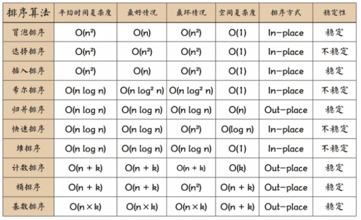

### 复杂度



### quick sort

```js
function quickSort (arr) {
    function rec (arr) {
        if (arr.length <= 1) return arr
        const left = []
        const right = []
        const mid = arr[0]
        for (let i = 0; i < arr.length; i++) {
            if (arr[i] < mid) {
                left.push(arr[i])
            } else {
                right.push(arr[i])
            }
        }
        return [...rec(left), mid, ...rec(right)]
    }
    return rec(arr)
}
```