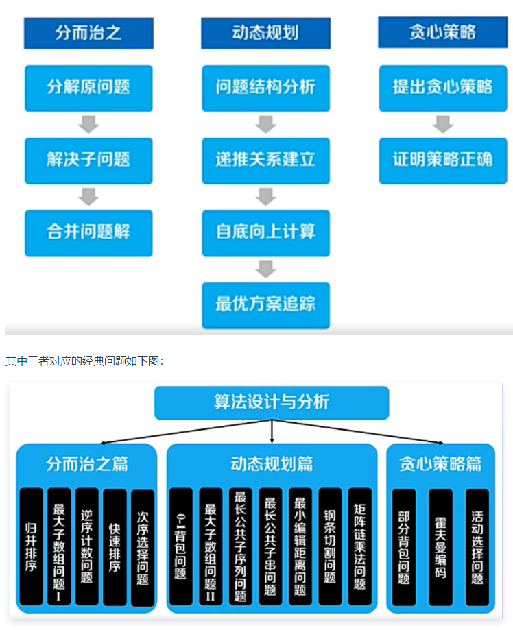

## 算法设计 



### 相关问题

1. 全排列
2. N 皇后
3. 给定一个数组,返回由这个数组最长的小于n的最大的数
4. 岛屿数量
    - 回溯 将已遍历过的都置为0


### 岛屿问题

1. 岛屿数量
    - 回溯 将已遍历过的都置为水
2. 统计封闭岛屿的书面
    - 先将靠边的岛屿过滤掉
3. 最大的岛屿面积


### 回溯

```js
    const result = [], path = [], used = []
    function fn () {
        if (nums.length === path.length) {
            result.push([...path])
            return
        }
        for (let i = 0; i < nums.length; i++) {
            if (used[i]) continue
            path.push(nums[i])
            used[i] = true
            fn()
            path.pop()
            used[i] = false
        }
    }
    fn([])
    return result
```

1. 记录 path used
2. 循环 i 为0 或者 start, 不为0 则为剪枝
3. push 递归 pop