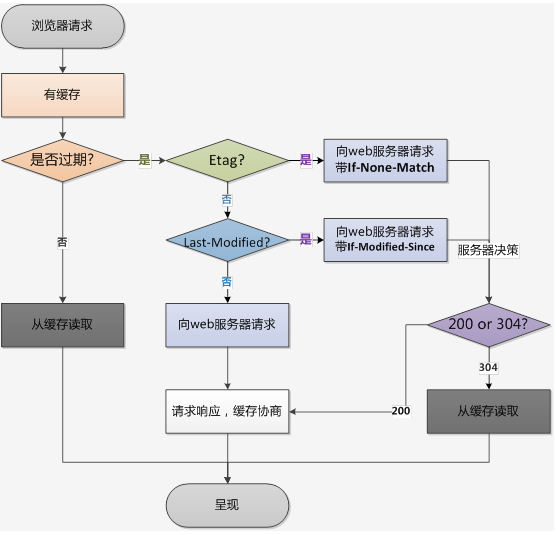

## active cache

`javaScript`本地缓存的方法我们主要讲述以下四种：

- cookie
- sessionStorage
- localStorage
- indexedDB


### cookie

- value 如果用于保存用户登录态，应该将该值加密，不能使用明文的用户标识
- http-only  不能通过 JS 访问 Cookie，减少 XSS 攻击
- secure 只能在协议为 HTTPS 的请求中携带
- same-site 规定浏览器不能在跨域请求中携带 Cookie，减少 CSRF 攻击


### indexedDB

浏览器提供的本地数据库， NOSQL 类型
特点:
1. 键值对存储
2. 异步读取
3. 支持事务(error, abort, complete) 只要有一步失败，整个事务就回滚到事务发生前
4. 同源限制
5. 存储空间大
6. 支持二进制存储

#### 操作流程

打开数据库 ， 返回 IDBRequest 对象

```javascript
openDB(name, version)
  - onsuccess
  - onerror
  - onupgradeneeded

transaction.objectStore(name)


```

#### 优点：

- 储存量理论上没有上限
- 所有操作都是异步的，相比 `LocalStorage` 同步操作性能更高，尤其是数据量较大时
- 原生支持储存` JS `的对象
- 是个正经的数据库，意味着数据库能干的事它都能干


## file cache


1. service worker
2. memory cache
3. disk cache 跨站点的情况，相同地址的也会被缓存，不会再去请求数据
4. push cache
5. PWA


### cache policy


文件缓存策略如下:



小结:  

强缓存 HTTP-Header:  Expires 和 cache-control 
  - expires HTTP/1 ， value 为 时间
  - cache-control HTTP/1.1 ，可由多个指令组成
    + max-age= 30  
    + no-catch  

协商缓存 HTTP-Header:  Last-Modified 和 ETag
  - Last-Modified 上次修改时间， 文件被打开也会变化
  - ETag 类似于文件指纹，
